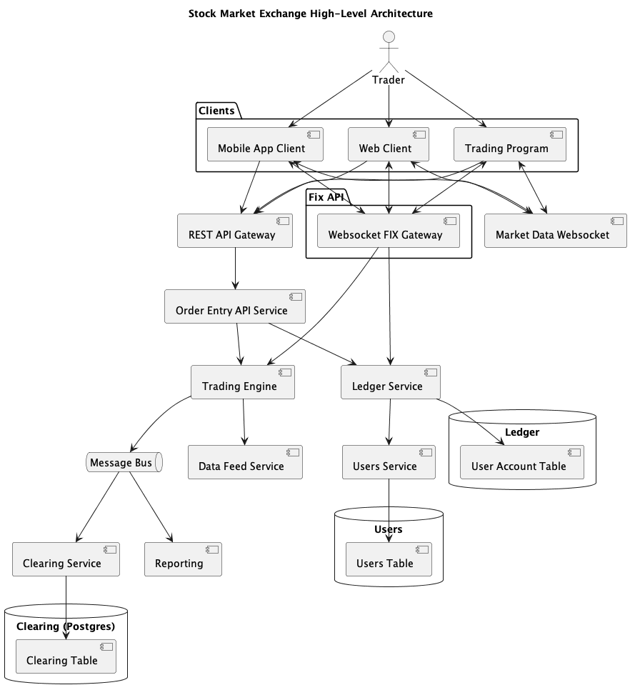
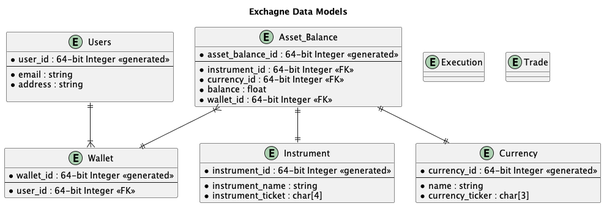

# Stock Exchange Question

## Problem Statement

Build a stock exchange system that matches buyers and sellers of an asset efficiently.

---

## Product Requirements

### Personas

Personas are ways to categorize and define our users. They provide attributes that help us to understand who they are, what skills they have, what they are trying to accomplish, and what problems they are trying to solve.

#### Persona: Retail Investor

An individual who buys and holds a cryptocurrency for 1 year or longer. Generally interested in the fundaments of a cryptocurrency, not the short-term fluctuations.

#### Persona: Retail Trader

An individual who actively buys and sells cryptocurrencies, attempting to capture short-term profit. Interested in charts and technical indicators.

#### Persona: Market Maker

An institution that actively trades both sides of the market, attempting to make the spread between the bid and the ask price.

### Functional Requirements

1. Place a market order to buy or sell a cryptocurrency.
1. Place a limit order to buy or sell a cryptocurrency.
1. Cancel a placed order that is not currently filled.
1. Get the current status of an order.
1. Get the last traded price for a cryptocurrency.
1. Get the current bid and ask prices for a cryptocurrency.
1. Subscribe to the market data stream for a cryptocurrency

### Non-functional Requirements

1. The system should be able to handle up to 1 million transactions per second.
1. The system should process orders as quickly as possible, ideally with a P99 latency less than 10 ms.
1. The system should maintain strong consistency for a customer's account balance.
1. The system should maintain at least 99.99% availability.

### Out-of-Scope Requirements

1. Transfer money into a customer's Exchange account.
1. Generate a user's trading history report.
1. Generate a user's tax statement.
1. We will not consider trading stocks, options, or futures.

---

## Assumptions and Capacity Estimation

### Assumptions

- 100 Cryptocurrencies available to trade
- 1 billion orders per day
- Trade 24/7
- Even distribution of trading orders

### Traffic

1 billion orders per day / (24 hours * 60 minutes * 60 seconds) = ~11,574 orders/second

#### Write Traffic

Nearly 100% of our traffic would be considered write traffic, while a small percentage could be considered read traffic, specifically to get the details of an order, or to cancel/modify an existing order, which would considered read then write.

#### Read Traffic

Very little. Less than 1%.

### Bandwidth

#### Write Bandwidth

#### Read Bandwidth

### Storage

## High-Level System Design

The following is an initial basic system design prior to any kind of optimization or scaling.

### Clients

### API Gateway

### Application Servers

### Database

---

## API

---

## Database and Data Model

### Database Selection

#### Database Decision

---

## Scaling

### DNS

### Content Delivery Network (CDN)

### Horizontal Scaling

### Caching

#### Cache Size

#### Cache Type

---

## Main Use Cases

### Use Case 1:

---

## Operations

### Performance

### Response Quality

### Host Metrics

---

## Tech Stack

---

## Links

[Coinbase Exchange APIs](https://docs.cloud.coinbase.com/exchange/docs)
